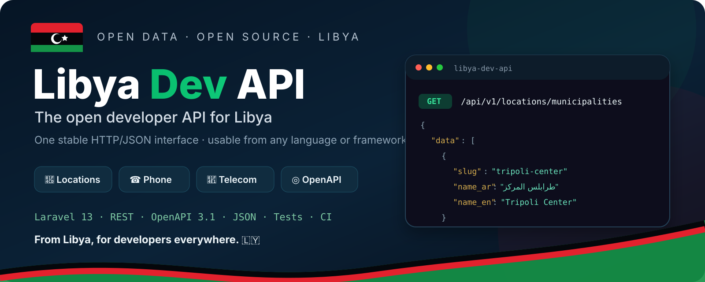

<p align="center">
  
</p>

# Libya Dev API 🇱🇾

> **The open developer API for Libya.** One stable HTTP/JSON interface for Libya-specific locations, phone normalization, telecom metadata, banks, public holidays, official exchange rates and business-day helpers.

[](https://github.com/ayagaidi/libya-dev-api/releases/latest)
[](https://github.com/ayagaidi/libya-dev-api/actions/workflows/tests.yml)
[](LICENSE)

**Laravel 13 · REST · OpenAPI 3.1 · JSON · Cache · Rate limiting · Tests · CI**

Libya Dev API is API-first: Laravel powers the backend, but consumers do **not** need PHP or Laravel. Any language that can make an HTTP request can integrate it.

## Current scope

- Libyan municipalities and cities through the pinned `Libya Locations v1.2.0` dataset
- Libyan mobile phone normalization and known operator-range validation
- telecom operator metadata with explicit source provenance
- **26-bank commercial bank directory from the Central Bank of Libya**
- **Libya public-holiday calendar** with annual confirmation rules for religious dates
- **live official Central Bank of Libya exchange rates** with buy/sell/average values
- normalized per-unit exchange rates when the CBL quotes 10 or 100 foreign-currency units
- **currency converter** between LYD and supported CBL currencies
- **business-day helpers** using Sunday–Thursday as the general public-sector workweek, Friday/Saturday as weekly rest, and the existing holiday calendar
- explicit provisional confidence when a future year's religious-holiday calendar is incomplete
- OpenAPI 3.1 contract at `/openapi.json` and Swagger UI at `/docs`
- public CORS, API rate limiting, caching and last-good exchange-rate fallback
- PHPUnit feature tests + Laravel Pint in GitHub Actions

## API endpoints

| Method | Endpoint | Purpose |
|---|---|---|
| GET | `/api/v1/meta` | API + Libya metadata |
| GET | `/api/v1/locations/municipalities` | municipalities, optional `?q=` |
| GET | `/api/v1/locations/municipalities/{slug}` | municipality by stable slug |
| GET | `/api/v1/locations/cities` | cities/places, optional `?q=` |
| POST | `/api/v1/phone/normalize` | normalize a Libyan mobile number |
| POST | `/api/v1/phone/validate` | validate format + known operator range |
| GET | `/api/v1/telecom/operators` | operator prefixes + provenance |
| GET | `/api/v1/banks` | commercial banks, optional `?q=` / `?city=` |
| GET | `/api/v1/banks/{slug}` | bank by stable slug |
| GET | `/api/v1/holidays` | current-year holiday calendar |
| GET | `/api/v1/holidays/{year}` | holiday calendar for a specific year |
| GET | `/api/v1/exchange-rates` | current official CBL exchange rates |
| GET | `/api/v1/exchange-rates/{currency}` | one rate by ISO currency code |
| POST | `/api/v1/currency/convert` | convert using `average`, `buy` or `sell` |
| GET | `/api/v1/calendar/is-business-day?date=YYYY-MM-DD` | business-day analysis |
| GET | `/api/v1/calendar/next-business-day?date=YYYY-MM-DD` | next business day |
| GET | `/api/v1/calendar/business-days?from=...&to=...` | inclusive range up to 366 days |
| GET | `/openapi.json` | OpenAPI contract |
| GET | `/docs` | interactive API documentation |

## Exchange-rate example

```bash
curl 'http://localhost:8000/api/v1/exchange-rates/USD'
```

The service reads the Central Bank of Libya exchange-rate page, caches successful results, and preserves a limited last-good cache if the upstream page is temporarily unavailable. Every record exposes both the published quote and normalized `per_unit_*` values.

Currency conversion:

```bash
curl -X POST http://localhost:8000/api/v1/currency/convert \
  -H 'Content-Type: application/json' \
  -d '{"amount":100,"from":"USD","to":"LYD","rate_type":"average"}'
```

The converter is mathematical reference tooling. It does not add transaction fees or determine eligibility for foreign-currency transactions.

## Business calendar example

```bash
curl 'http://localhost:8000/api/v1/calendar/is-business-day?date=2026-09-16'
```

The general public-sector schedule is modeled as Sunday–Thursday workdays and Friday/Saturday weekly rest. Official holidays are then excluded using the same holiday dataset exposed by `/api/v1/holidays/{year}`. If a future year's floating religious dates are not fully confirmed, the response is marked `provisional_incomplete_holiday_calendar` rather than presented as fully authoritative.

## Phone example

```bash
curl -X POST http://localhost:8000/api/v1/phone/validate \
  -H 'Content-Type: application/json' \
  -d '{"phone":"0912345678"}'
```

> Operator detection is prefix/range metadata. It is **not** a live subscriber or mobile-number-portability lookup.

## Install

```bash
cp .env.example .env
composer install
php artisan key:generate
php artisan serve
```

Then open `http://localhost:8000/docs`.

## Data provenance

Locations are read from the version-pinned `Libya Locations v1.2.0` dataset. Telecom metadata carries source URLs and verification strength. Banks are based on the Central Bank of Libya commercial-bank directory. Holidays distinguish statutory dates from year-specific confirmations. Exchange rates are fetched from the official Central Bank of Libya exchange-rate page, and business-day rules cite the public-sector workweek decision.

See [`DATA_SOURCES.md`](DATA_SOURCES.md).

## Design principles

1. **No guessed Libya-specific facts.** Missing or uncertain data is labelled, not invented.
2. **Stable versioned API.** Breaking changes require a new API version.
3. **Language agnostic.** HTTP + JSON + OpenAPI are the contract.
4. **Source provenance.** Country-specific metadata should point to its source.
5. **Small core, useful modules.** New primitives are added only when a maintainable source and clear developer use case exist.

## Roadmap

See [`ROADMAP.md`](ROADMAP.md).

## Security

See [`SECURITY.md`](SECURITY.md). Do not report suspected vulnerabilities in a public issue.

## License

MIT. See [`LICENSE`](LICENSE).

Maintained by **Aya Aljaidi** — building open developer infrastructure for Libya. 🇱🇾
